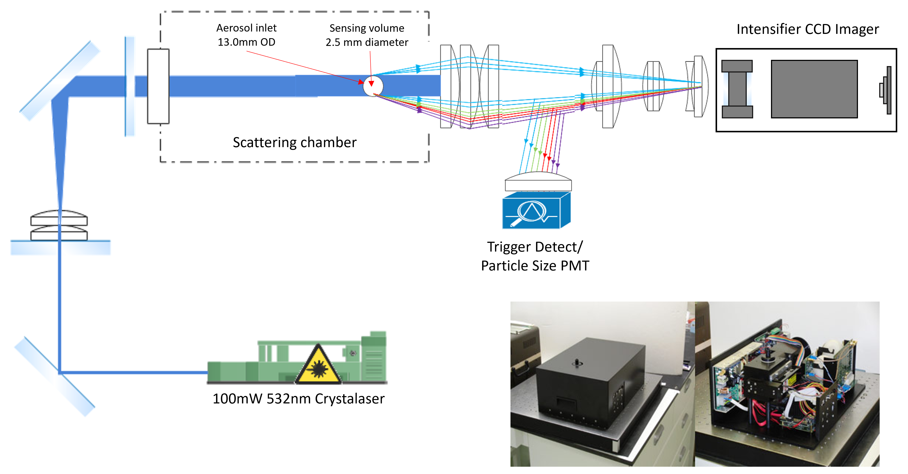
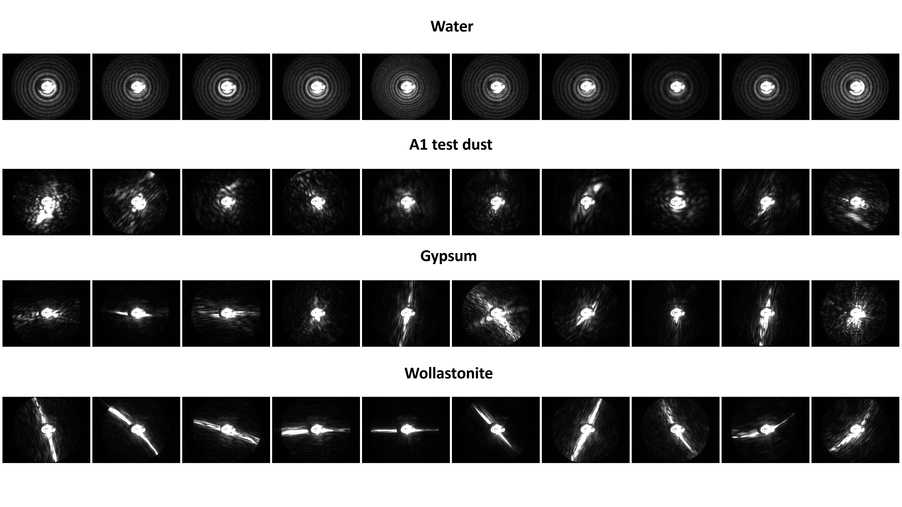
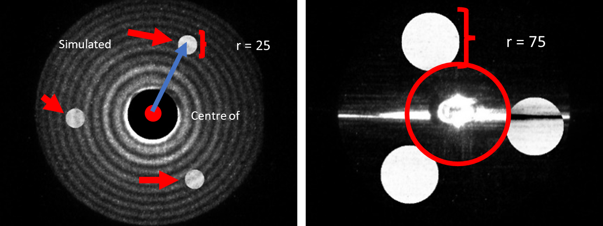
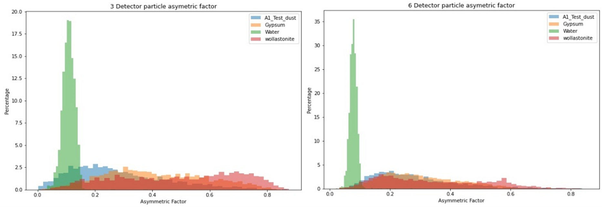
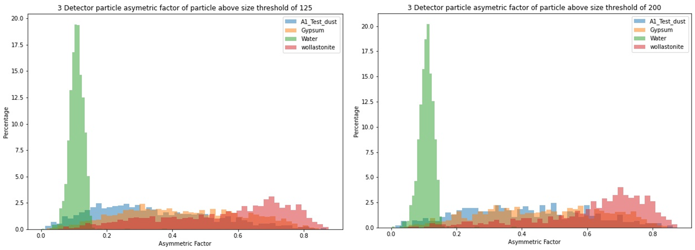

# light-scattering-particle-classification
# Particle Classification from PPD-2 Light Scattering Patterns

## Overview

This project investigates whether simplified detector layouts can be used to classify airborne particles from high-resolution 2-D light scattering patterns recorded by the Particle Phase Discriminator 2 (PPD-2).

The main goal was to test whether simulated detector masks could distinguish between spherical droplets and fibre-like particles using scattering asymmetry.

This work was motivated by a limitation of standard optical particle counters. Optical particle counters can estimate particle size using light scattering, but they usually cannot classify particles by shape. Shape is important because fibre-like particles can pose serious health risks, especially in occupational and environmental air monitoring.

The project shows that a simplified detector-based system could potentially support real-time classification of harmful airborne particles by using shape information from light scattering patterns.

## Project Aim

The aim of this project was to use PPD-2 scattering pattern data to test whether a simplified detector-based system could classify different particle types.

The project focused on:

- Simulating low-cost detector arrangements on PPD-2 scattering images
- Calculating particle asymmetry from detector intensity values
- Comparing 3-detector and 6-detector layouts
- Testing whether droplets and fibres could be separated using an asymmetry factor
- Assessing how detector radius and intensity thresholds affected classification

## Background

The PPD-2 records high-resolution spatial light scattering patterns from individual airborne particles. These patterns contain information about particle morphology.

Spherical droplets tend to produce symmetrical ring-like scattering patterns. Fibre-like particles produce more asymmetric scattering patterns because their shape and orientation affect how light is scattered.

This project tested whether those differences could be captured using a smaller number of simulated detectors. This could support the development of a simpler and lower-cost real-time particle classification system.



*PPD-2 optical layout used to capture 2-D scattering patterns from individual airborne particles.*

## Data

Scattering pattern data was collected from four particle types:

| Particle type | Description |
|---|---|
| Water spray | Spherical droplets |
| Wollastonite | Fibre-like particles |
| Gypsum | Mixed dust and fibre-like particles |
| A1 test dust | Irregular dust particles |

Each sample was aerosolised and introduced into the PPD-2. Individual particles crossed the laser beam, producing scattering patterns that were captured using the PPD-2 imaging system.



*Example scattering patterns for water droplets, A1 test dust, gypsum and wollastonite.*

## Method

The analysis was carried out in Python using a Jupyter Notebook.

The main steps were:

1. Load PPD-2 scattering pattern images.
2. Define the centre of the scattering pattern.
3. Place simulated circular detector masks around the centre.
4. Sum the pixel intensity within each detector mask.
5. Calculate an asymmetry factor from the detector intensity values.
6. Compare asymmetry factor distributions between particle types.
7. Test different detector layouts, detector radii and intensity thresholds.

## Simulated Detector Layout

The detector masks were arranged symmetrically around the scattering centre.

Two detector layouts were compared:

- 3 detectors
- 6 detectors

Detector radius was also varied to test whether larger detectors captured more useful scattering information.



*Simulated detector masks placed around the centre of a scattering pattern.*

## Asymmetry Factor

The asymmetry factor was calculated from the relative intensity values measured by the simulated detectors.

The principle was:

| Scattering behaviour | Expected particle type | Asymmetry factor |
|---|---|---|
| Symmetrical ring-like scattering | Droplets | Low |
| Directional or uneven scattering | Fibre-like particles | High |

This allowed each scattering pattern to be reduced into a numerical feature that could be used for classification.

## Results

The simulated detector approach was able to separate droplets from fibre-like particles.

Water droplets were concentrated at low asymmetry factor values because their scattering patterns were more circular and symmetrical. Wollastonite fibres showed higher asymmetry factor values because their scattering patterns were more directional and asymmetric.



*Asymmetry factor distributions for different particle types using 3-detector and 6-detector layouts.*

## Key Findings

- Water droplets were clearly associated with low asymmetry factor values.
- Wollastonite fibres were more prominent at high asymmetry factor values.
- Applying an intensity threshold improved separation between droplets and fibres.
- A threshold of 125 intensity per pixel gave a useful balance between improved classification and particle loss.
- Larger detector radii improved water droplet separation and helped capture more of the scattering pattern.
- The 6-detector layout improved separation between water and the other particle types.
- The 3-detector layout produced a wider spread of asymmetry factor values, making the fibre peak more visible.
- Separation between A1 test dust and gypsum was weaker because their scattering profiles overlapped.
- Gypsum showed some fibre-like scattering patterns, which contributed to overlap with wollastonite.



*Effect of applying intensity thresholds on asymmetry factor separation.*

## Classification Outcomes

The best separation was achieved between droplets and fibre-like particles.

| Detector setup | Threshold | Outcome |
|---|---:|---|
| 3 detectors, radius 25 px | Af < 0.17 | Mostly water droplets |
| 3 detectors, radius 75 px | Af < 0.17 | Stronger water droplet separation |
| 3 detectors, radius 75 px | Af > 0.6 | Increased wollastonite fibre classification |
| 6 detectors, radius 50 px | Low Af threshold | Strong water droplet classification |
| 6 detectors, radius 50 px | High Af threshold | Strong fibre-like particle classification |

The results suggest that simplified detector arrangements can retain enough information from PPD-2 scattering patterns to support particle shape classification.

## Conclusion

This project showed that PPD-2 scattering pattern data can be reduced into simulated detector intensity values while still preserving useful particle shape information.

The method was most effective for distinguishing spherical droplets from fibre-like particles. This supports the potential development of a lower-cost, portable real-time particle classifier that can classify airborne particles by both size and shape.

## Future Work

Future improvements could include:

- Calibrating the system with monodisperse polystyrene spheres for clearer size definition
- Developing automated threshold selection
- Testing additional particle types
- Building a real-time classification pipeline
- Training machine learning models on detector-derived features
- Comparing detector-derived features against full-image feature extraction

## Technologies Used

- Python
- Jupyter Notebook
- NumPy
- Pandas
- Matplotlib
- Image processing
- Scientific data analysis

## Repository Structure

```text
.
├── README.md
├── notebooks/
│   └── annotated_tbs_circle_sum_comparison_6_detectors.ipynb
├── images/
│   ├── ppd2_schematic.png
│   ├── scattering_patterns_particle_types.png
│   ├── simulated_detector_masks.png
│   ├── asymmetry_factor_comparison.png
│   └── thresholding_effect.png
└── data/
    └── raw_scattering_patterns/
